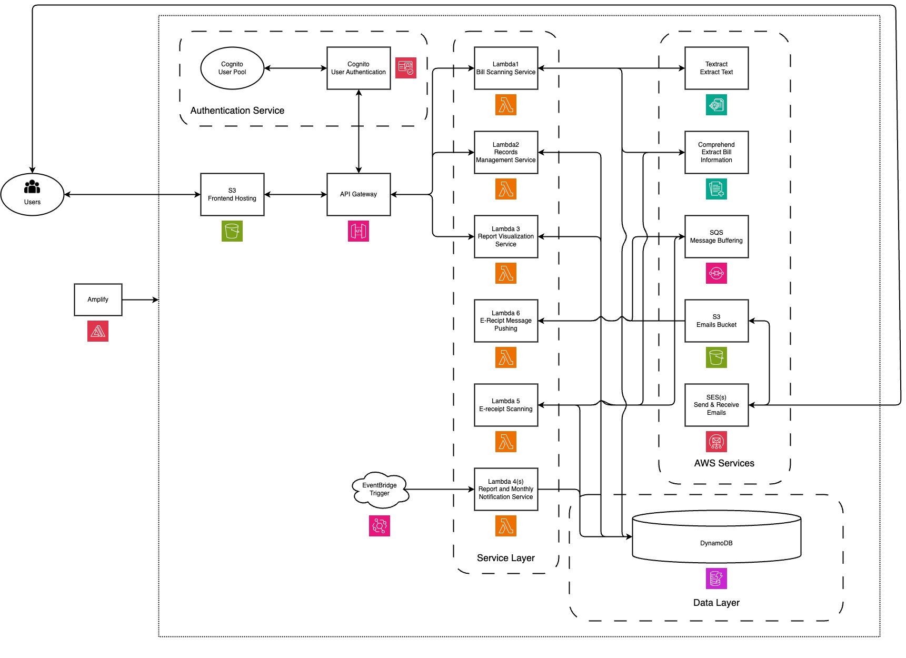

# Control Your Wealth FE
## [report](./report.pdf)
## System Architecture

## Usage
1. clone this repo
2. In `js` folder, add `config.js`:
    ```
    const config = {
        UserPoolId:  Your UserPool ID,
        ClientId: Your Client ID,
    };
    ```
3. Open html using Live Server

    e.g. Extenstion `ritwickdey.LiveServer` in VS code
4. Lambda files can be found in [lambda](./lambda/)
   
## predefined category
`Food`,`Clothing`,`Living`,`Transportation`, `Others`
